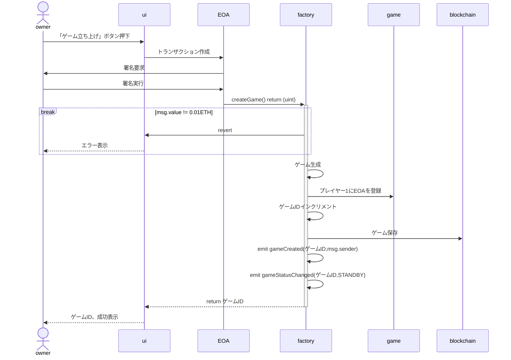
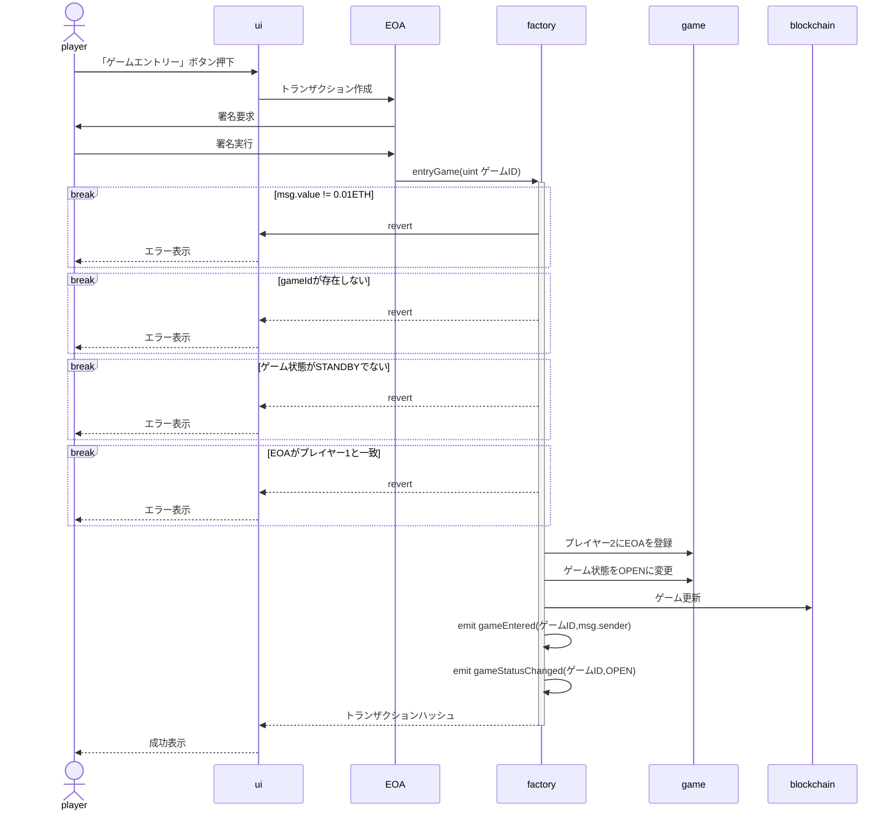
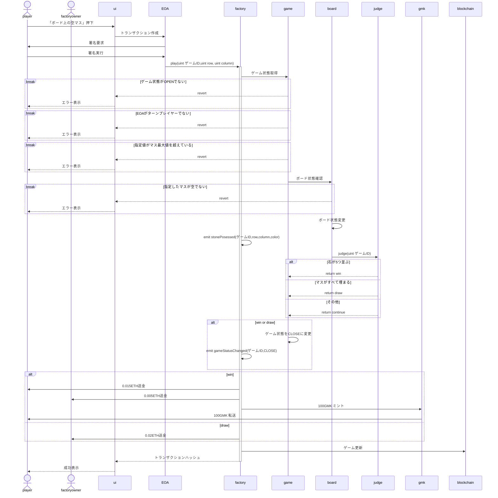
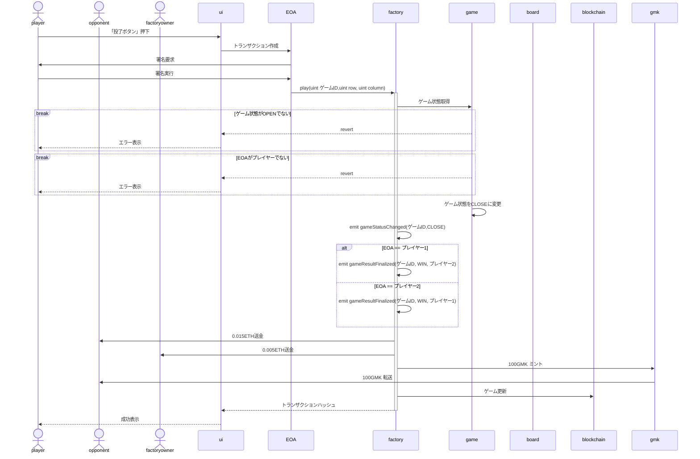

# ゲームプレイヤー
## ゲームを立ち上げる

```mermaid
sequenceDiagram
    actor owner
    participant ui
    participant EOA
    participant factory
    participant game
    participant blockchain

    owner->>ui: 「ゲーム立ち上げ」ボタン押下
    ui->>EOA: トランザクション作成
    EOA->>owner: 署名要求
    owner->>EOA: 署名実行
    EOA->>+factory: createGame() return (uint)
    break msg.value != 0.01ETH
        factory->>ui: revert
        ui-->>owner: エラー表示
    end
    factory->>factory: ゲーム生成
    factory->>game: プレイヤー1にEOAを登録
    factory->>factory: ゲームIDインクリメント
    factory->>blockchain: ゲーム保存
    factory->>factory: emit gameCreated(ゲームID,msg.sender)
    factory->>factory: emit gameStatusChanged(ゲームID,STANDBY)

    factory-->>-ui: return ゲームID
    ui-->>owner: ゲームID、成功表示
```
## ゲームにエントリーする

```mermaid
sequenceDiagram
    actor player
    participant ui
    participant EOA
    participant factory
    participant game
    participant blockchain

    player->>ui: 「ゲームエントリー」ボタン押下
    ui->>EOA: トランザクション作成
    EOA->>player: 署名要求
    player->>EOA: 署名実行
    EOA->>+factory: entryGame(uint ゲームID)
    break msg.value != 0.01ETH
        factory->>ui: revert
        ui-->>player: エラー表示
    end
    break gameIdが存在しない
        factory-->>ui: revert
        ui-->>player: エラー表示
    end
    break ゲーム状態がSTANDBYでない
        factory-->>ui: revert
        ui-->>player: エラー表示
    end
    break EOAがプレイヤー1と一致
        factory-->>ui: revert
        ui-->>player: エラー表示
    end
    factory->>game: プレイヤー2にEOAを登録
    factory->>game: ゲーム状態をOPENに変更
    factory->>blockchain: ゲーム更新
    factory->>factory: emit gameEntered(ゲームID,msg.sender)
    factory->>factory: emit gameStatusChanged(ゲームID,OPEN)
    factory-->>-ui: トランザクションハッシュ
    ui-->>player: 成功表示
```
## プレイする

```mermaid
sequenceDiagram
    actor player
    actor factoryowner
    participant ui
    participant EOA
    participant factory
    participant game
    participant board
    participant judge
    participant gmk
    participant blockchain

    player->>ui: 「ボード上の空マス」押下
    ui->>EOA: トランザクション作成
    EOA->>player: 署名要求
    player->>EOA: 署名実行
    EOA->>+factory: play(uint ゲームID,uint row, uint column)
    factory->>game: ゲーム状態取得
    break ゲーム状態がOPENでない
        game-->>ui: revert
        ui-->>player: エラー表示
    end
    break EOAがターンプレイヤーでない
        game-->>ui: revert
        ui-->>player: エラー表示
    end
    break 指定値がマス最大値を超えている
        game-->>ui: revert
        ui-->>player: エラー表示
    end
    game->>board: ボード状態確認
    break 指定したマスが空でない
        board-->>ui: revert
        ui-->>player: エラー表示
    end
    board->>board: ボード状態変更
    factory->>factory: emit stonePosessed(ゲームID,row,column,color)
    board->>judge: judge(uint ゲームID)
    alt 石が5つ並ぶ
        judge-->>game: return win
    else マスがすべて埋まる
        judge-->>game: return draw
    else その他
        judge-->>game: return continue
    end
    alt win or draw
        game->>game: ゲーム状態をCLOSEに変更
        factory->>factory: emit gameStatusChanged(ゲームID,CLOSE)
    end
    alt win
        factory->>player: 0.015ETH送金
        factory->>factoryowner: 0.005ETH送金
        factory->>gmk: 100GMK ミント
        gmk->>player: 100GMK 転送
    else draw
        factory->>factoryowner: 0.02ETH送金
    end
    factory->>blockchain: ゲーム更新
    factory-->>-ui: トランザクションハッシュ
    ui-->>player: 成功表示
```
## 投了する

```mermaid
sequenceDiagram
    actor player
    actor opponent
    actor factoryowner
    participant ui
    participant EOA
    participant factory
    participant game
    participant board
    participant blockchain
    participant gmk

    player->>ui: 「投了ボタン」押下
    ui->>EOA: トランザクション作成
    EOA->>player: 署名要求
    player->>EOA: 署名実行
    EOA->>+factory: play(uint ゲームID,uint row, uint column)
    factory->>game: ゲーム状態取得
    break ゲーム状態がOPENでない
        game-->>ui: revert
        ui-->>player: エラー表示
    end
    break EOAがプレイヤーでない
        game-->>ui: revert
        ui-->>player: エラー表示
    end
    game->>game: ゲーム状態をCLOSEに変更
    factory->>factory: emit gameStatusChanged(ゲームID,CLOSE)
    alt EOA == プレイヤー1
        factory->>factory: emit gameResultFinalized(ゲームID, WIN, プレイヤー2);
    else EOA == プレイヤー2
        factory->>factory: emit gameResultFinalized(ゲームID, WIN, プレイヤー1);
    end
    factory->>opponent: 0.015ETH送金
    factory->>factoryowner: 0.005ETH送金
    factory->>gmk: 100GMK ミント
    gmk->>opponent: 100GMK 転送
    factory->>blockchain: ゲーム更新
    factory-->>-ui: トランザクションハッシュ
    ui-->>player: 成功表示
```