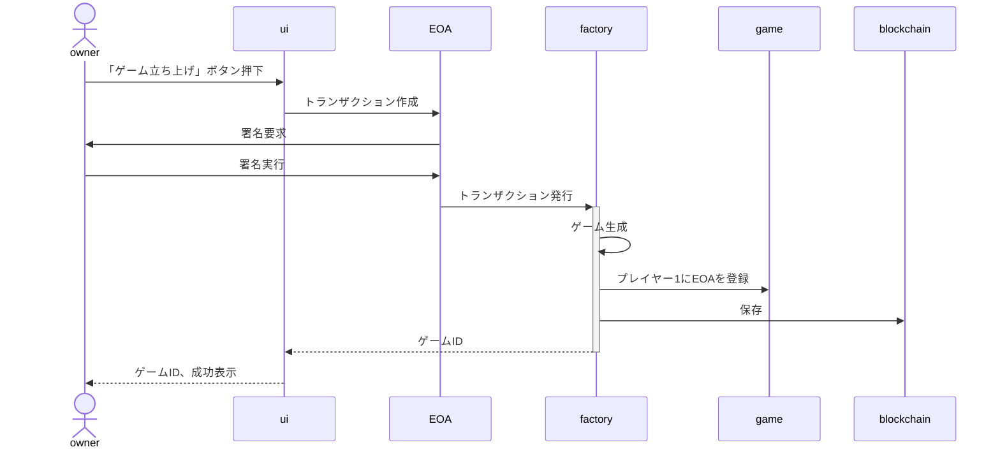
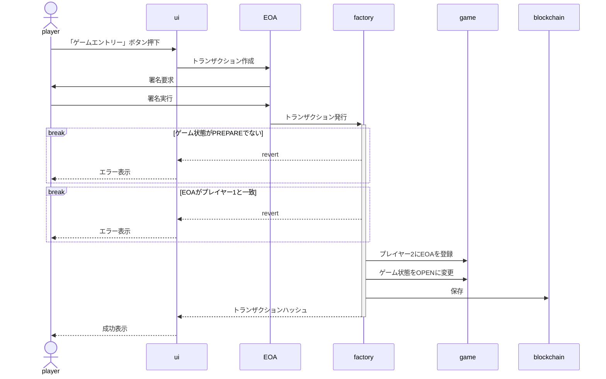
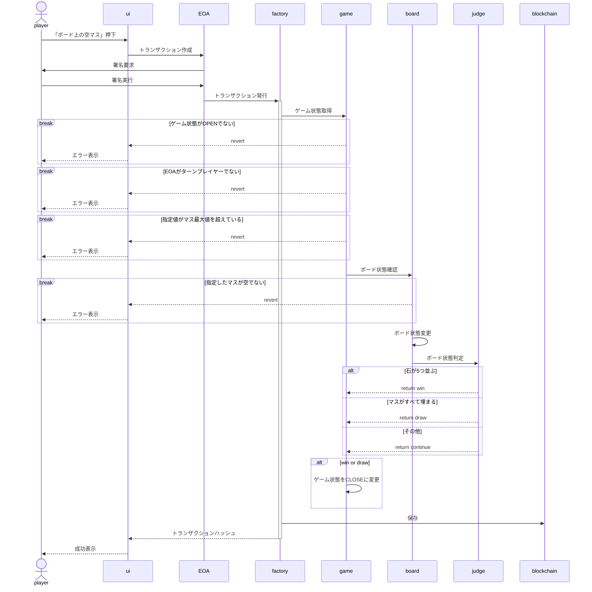

# ゲームプレイヤー
## ゲームを立ち上げる

```mermaid
sequenceDiagram
    actor owner
    participant ui
    participant EOA
    participant factory
    participant game
    participant blockchain

    owner->>ui: 「ゲーム立ち上げ」ボタン押下
    ui->>EOA: トランザクション作成
    EOA->>owner: 署名要求
    owner->>EOA: 署名実行
    EOA->>+factory: トランザクション発行
    factory->>factory: ゲーム生成
    factory->>game: プレイヤー1にEOAを登録
    factory->>blockchain: 保存
    factory-->>-ui: ゲームID
    ui-->>owner: ゲームID、成功表示
```
## ゲームにエントリーする

```mermaid
sequenceDiagram
    actor player
    participant ui
    participant EOA
    participant factory
    participant game
    participant blockchain

    player->>ui: 「ゲームエントリー」ボタン押下
    ui->>EOA: トランザクション作成
    EOA->>player: 署名要求
    player->>EOA: 署名実行
    EOA->>+factory: トランザクション発行
    break ゲーム状態がPREPAREでない
        factory-->>ui: revert
        ui-->>player: エラー表示
    end
    break EOAがプレイヤー1と一致
        factory-->>ui: revert
        ui-->>player: エラー表示
    end
    factory->>game: プレイヤー2にEOAを登録
    factory->>game: ゲーム状態をOPENに変更
    factory->>blockchain: 保存
    factory-->>-ui: トランザクションハッシュ
    ui-->>player: 成功表示
```
## プレイする

```mermaid
sequenceDiagram
    actor player
    participant ui
    participant EOA
    participant factory
    participant game
    participant board
    participant judge
    participant blockchain

    player->>ui: 「ボード上の空マス」押下
    ui->>EOA: トランザクション作成
    EOA->>player: 署名要求
    player->>EOA: 署名実行
    EOA->>+factory: トランザクション発行
    factory->>game: ゲーム状態取得
    break ゲーム状態がOPENでない
        game-->>ui: revert
        ui-->>player: エラー表示
    end
    break EOAがターンプレイヤーでない
        game-->>ui: revert
        ui-->>player: エラー表示
    end
    break 指定値がマス最大値を超えている
        game-->>ui: revert
        ui-->>player: エラー表示
    end
    game->>board: ボード状態確認
    break 指定したマスが空でない
        board-->>ui: revert
        ui-->>player: エラー表示
    end
    board->>board: ボード状態変更
    board->>judge: ボード状態判定
    alt 石が5つ並ぶ
        judge-->>game: return win
    else マスがすべて埋まる
        judge-->>game: return draw
    else その他
        judge-->>game: return continue
    end
    alt win or draw
        game->>game: ゲーム状態をCLOSEに変更
    end
    factory->>blockchain: 保存
    factory-->>-ui: トランザクションハッシュ
    ui-->>player: 成功表示
```