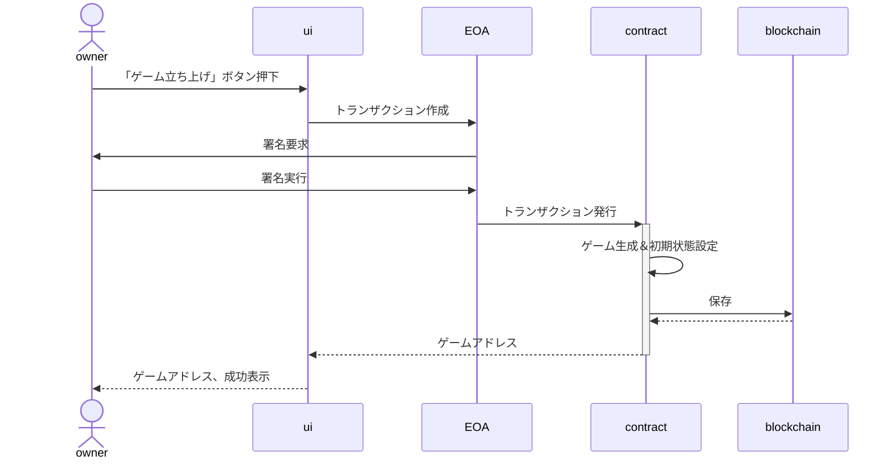
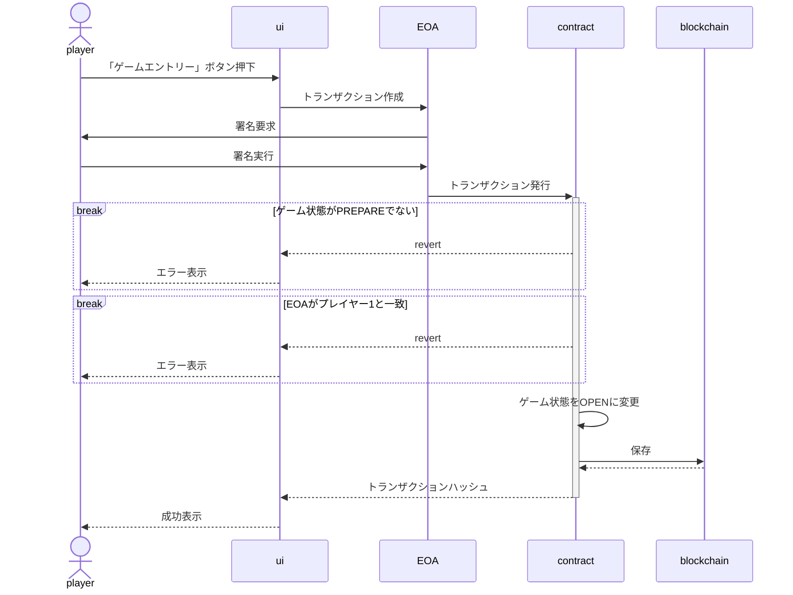
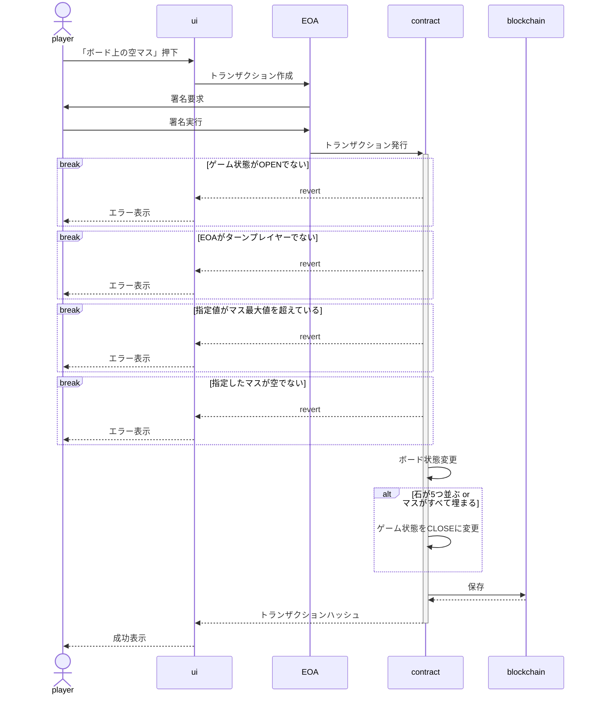

# ゲームオーナー
## ゲームを開く

```mermaid
sequenceDiagram
    actor owner
    participant ui
    participant EOA
    participant contract
    participant blockchain

    owner->>ui: 「ゲーム立ち上げ」ボタン押下
    ui->>EOA: トランザクション作成
    EOA->>owner: 署名要求
    owner->>EOA: 署名実行
    EOA->>+contract: トランザクション発行
    contract->>contract: ゲーム生成＆初期状態設定
    contract->>blockchain: 保存
    blockchain-->>contract: 
    contract-->>-ui: ゲームアドレス
    ui-->>owner: ゲームアドレス、成功表示
```

# ゲームプレイヤー
## ゲームにエントリーする

```mermaid
sequenceDiagram
    actor player
    participant ui
    participant EOA
    participant contract
    participant blockchain

    player->>ui: 「ゲームエントリー」ボタン押下
    ui->>EOA: トランザクション作成
    EOA->>player: 署名要求
    player->>EOA: 署名実行
    EOA->>+contract: トランザクション発行
    break ゲーム状態がPREPAREでない
        contract-->>ui: revert
        ui-->>player: エラー表示
    end
    break EOAがプレイヤー1と一致
        contract-->>ui: revert
        ui-->>player: エラー表示
    end
    contract->>contract: ゲーム状態をOPENに変更
    contract->>blockchain: 保存
    blockchain-->>contract: 
    contract-->>-ui: トランザクションハッシュ
    ui-->>player: 成功表示
```
## 石を置く

```mermaid
sequenceDiagram
    actor player
    participant ui
    participant EOA
    participant contract
    participant blockchain

    player->>ui: 「ボード上の空マス」押下
    ui->>EOA: トランザクション作成
    EOA->>player: 署名要求
    player->>EOA: 署名実行
    EOA->>+contract: トランザクション発行
    break ゲーム状態がOPENでない
        contract-->>ui: revert
        ui-->>player: エラー表示
    end
    break EOAがターンプレイヤーでない
        contract-->>ui: revert
        ui-->>player: エラー表示
    end
    break 指定値がマス最大値を超えている
        contract-->>ui: revert
        ui-->>player: エラー表示
    end
    break 指定したマスが空でない
        contract-->>ui: revert
        ui-->>player: エラー表示
    end
    contract->>contract: ボード状態変更
    alt 石が5つ並ぶ or マスがすべて埋まる
        contract->>contract: ゲーム状態をCLOSEに変更
    end
    contract->>blockchain: 保存
    blockchain-->>contract: 
    contract-->>-ui: トランザクションハッシュ
    ui-->>player: 成功表示
```