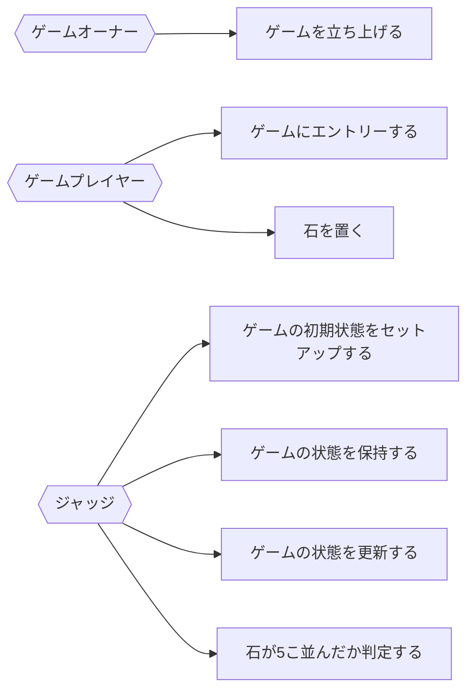

```mermaid
    flowchart LR

    ow{{ゲームオーナー}}
    p{{ゲームプレイヤー}}
    j{{ジャッジ}}

    ow-->OW1[ゲームを立ち上げる]
    p-->P1[ゲームにエントリーする]
    p-->P2[石を置く]

    j-->J1[ゲームの初期状態をセットアップする]
    j-->J2[ゲームの状態を保持する]
    j-->J3[ゲームの状態を更新する]
    j-->J4[石が5こ並んだか判定する]
```