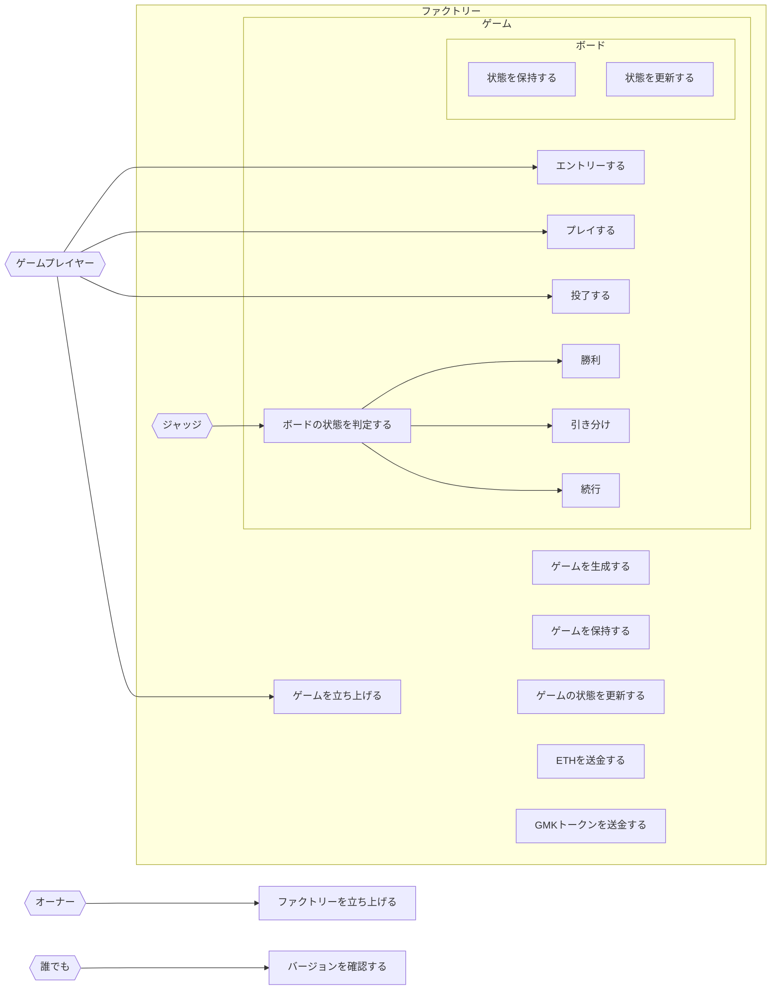

```mermaid
    flowchart LR

    ow{{オーナー}}
    p{{ゲームプレイヤー}}
    j{{ジャッジ}}
    e{{誰でも}}

    ow--->OW1[ファクトリーを立ち上げる]
    F1[ゲームを生成する]
    F2[ゲームを保持する]
    F3[ゲームの状態を更新する]
    F4[ETHを送金する]
    F5[GMKトークンを送金する]
    p--->P1[ゲームを立ち上げる]
    p---->P2[エントリーする]
    p---->P3[プレイする]
    p---->P4[投了する]

    j-->J1[ボードの状態を判定する]
    J1-->J1J1[勝利]
    J1-->J1J2[引き分け]
    J1-->J1J3[続行]

    B1[状態を保持する]
    B2[状態を更新する]

    e--->E1[バージョンを確認する]

    subgraph ファクトリー
        P1
        F1
        F2
        F3
        F4
        F5
        j
        subgraph ゲーム
            P2
            P3
            P4
            J1
            J1J1
            J1J2
            J1J3
            subgraph ボード
                B1
                B2
            end
        end
    end
```