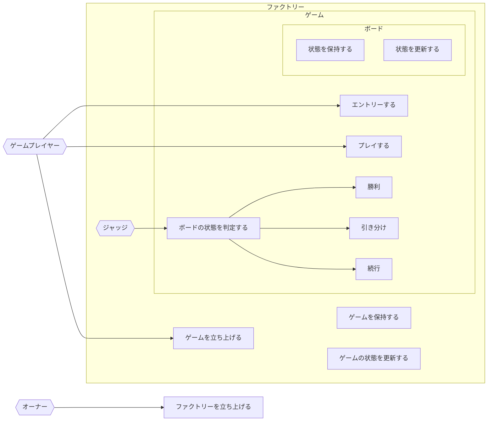

```mermaid
    flowchart LR

    ow{{オーナー}}
    p{{ゲームプレイヤー}}
    j{{ジャッジ}}

    ow--->OW1[ファクトリーを立ち上げる]
    OW2["ゲームを保持する"]
    OW3["ゲームの状態を更新する"]
    p--->P1[ゲームを立ち上げる]
    p---->P2[エントリーする]
    p---->P3[プレイする]

    j-->J1[ボードの状態を判定する]
    J1-->J1J1[勝利]
    J1-->J1J2[引き分け]
    J1-->J1J3[続行]

    B1["状態を保持する"]
    B2["状態を更新する"]


    subgraph ファクトリー
        P1
        OW2
        OW3
        j
        subgraph ゲーム
            P2
            P3
            J1
            J1J1
            J1J2
            J1J3
            subgraph ボード
                B1
                B2
            end
        end
    end
```